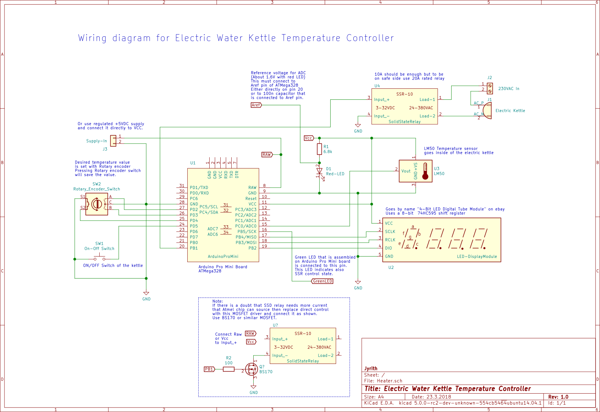

## Electric Water Kettle Temperature Controller

### BOM
- Arduino Pro Mini Board (Arduino Pro mini, 5V, 16MHz)
- 4 digit 7-segment display module. "Digital Tube LED Display Module" or similar on ebay
- Solid State Relay (230VAC, 10A or 20A)
- LM50 temperature sensor
- Rotary Encode with Switch (example Bourns PEC11)
- Push button switch
- Red LED & 6,8k resistor or 1.600 V voltage reference

Other stuff you will need
- FTDI Basic Breakout & avrdude software to program Arduino Pro Mini Board.


[PDF version of the Wiring diagram](doc/Heater.pdf)



### Description
A short description how the device works i.e. functional description of the device

SW1 switch will turn ON and OFF the devide. Desired water temperature value can be set by pressing the switch of the Rotary Encoder and turning Rotary Encoder clockwise and counterclockwise. Pressing encoders switch will save the selected temperature value. The temperature value is saved to the internal eeprom of the ATMega328 and it will be read from eeprom when device is turned ON. SW1 switch will turn the devide OFF and puts it in sleep mode. When device is turned ON the temperature of the water is measured with LM50 temperature sensor and when setted temperature value is reached the SSR relay will be turned OFF and the kettle supply is disconnected. Device will keep reading the temperature and displays the temperature on 7-segment display.

### Step-By-Step How to select desired temperature value
 - Turn device on by pressing On/Off key. 
	- Display will turn on and current temperature value of sensor is shown on display.
 - Press Rotary Encoder switch.
	- Display will show temperature setting value.
 - Rotate encoder clockwise and counterclockwise to select desire temperature value.
	- Resolution is 1 celsius degree.
 - When desire temperature value is shown on display press Rotary Encoder switch.
	- Selected temperature value is saved on controller internal eeprom.
	- Value will retain during power off.


### HowTo build up
1. Calculate mV_Step256 value according the voltage reference you use and modify thermostat.c file with a calculated value and build a new hex file. If you use LED then just measure the voltage across the LED and use that value. Remember that unit is mV when calculating a new value.
2. Load the thermostat.hex file on the Arduino Pro Mini board. Connect FTDI Basic Breakout or similar module to Arduino Pro Mini to load the hex file. If FTDI board has a jumper on the board that allows the board to be configured to either 3.3V or 5V then connect jumper for 5V. FTDI board should be able to supply enought current for Arduino board during programming if not then connect external power supply on RAW pin of the Arduino board. Type or copy and paste the following command on command promt

```
avrdude -p atmega168 -P com6 -b 19200 -c arduino -U flash:w:thermostat.hex"
```
Change 'com6' part according to which port you connected the FTDI board.

If you use board with atmega328p on then use this command:
```
avrdude -p atmega328p -P com6 -b 57600 -c arduino -U flash:w:thermostat.hex"
```


If everything went right you should get similar response as below

```
"avrdude -p atmega168 -P com6 -b 19200 -c arduino -U flash:w:thermostat.hex"
Below is messages that you should get if programming of the Arduino went well
----------------------------------------------------------------------------
avrdude: AVR device initialized and ready to accept instructions

Reading | ################################################## | 100% 0.03s

avrdude: Device signature = 0x1e950f
avrdude: NOTE: FLASH memory has been specified, an erase cycle will be performed

         To disable this feature, specify the -D option.
avrdude: erasing chip
avrdude: reading input file "thermostat.hex"
avrdude: input file thermostat.hex auto detected as Intel Hex
avrdude: writing flash (1430 bytes):

Writing | ################################################## | 100% 0.89s

avrdude: 1430 bytes of flash written
avrdude: verifying flash memory against thermostat.hex:
avrdude: load data flash data from input file thermostat.hex:
avrdude: input file thermostat.hex auto detected as Intel Hex
avrdude: input file thermostat.hex contains 1430 bytes
avrdude: reading on-chip flash data:

Reading | ################################################## | 100% 0.80s

avrdude: verifying ...
avrdude: 1430 bytes of flash verified

avrdude: safemode: Fuses OK

avrdude done.  Thank you.
----------------------------------------------------------------------------
```

3. Connect other components according to the wiring diagram. Before you connect 230AC voltage test that all working fine. Turn devide ON with SW1 switch and display should show temperature. Press Rotary Encoder switch ones and turn Rotary Encoder knob and value on display should change. Select example 30C temperature and press Rotary Encoder switch to save a new temperature setting value. Take temparature sensor in your hand to warm it up. When temperature rise to 30C and above the green LED on Arduino board should turn off and stay off untill your turn device off. And when you turn the devide on again  green LED turns on (assuming that temperature sensor is cooled below the 30C). If everything works ok the set your desired temperature value (example 85C) and connect 230VAC lines and put temperature sensor inside the kettle so it's under the water level.


### Author
- Jyrith

